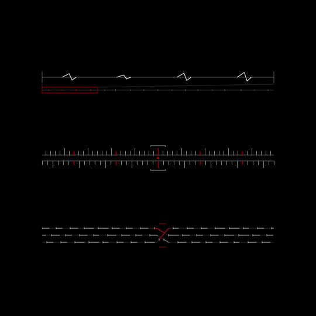
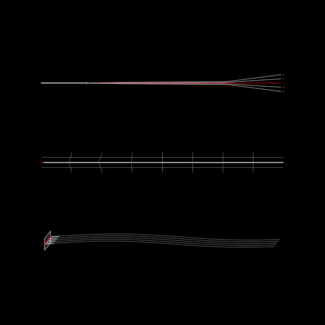
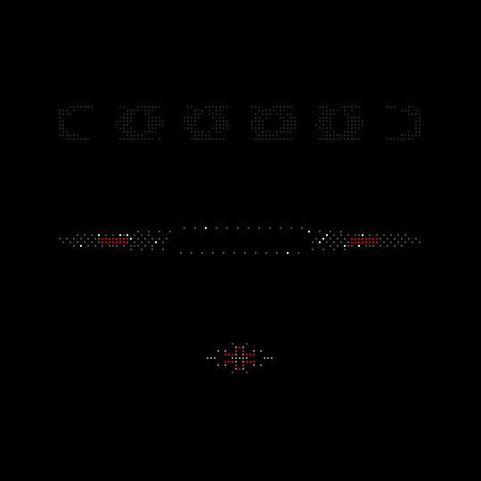

# iwrzwr / visual archive

155 experimental sound and music visualizer studies built with javascript and html canvas. explore waveform animations, spectrum-inspired displays, matrix patterns, particle fields, rhythm, memory, and mechanical motion — with drawing code and live examples to study and adapt for creative-coding projects. all gallery animations run from code, with no video playback or iframes.

signals are simulated. this is a visual archive, not a real audio-analysis engine or the native iwrzwr app.

like it? [leave a star on github](https://github.com/kaganin/iwrzwr-visual-archive) — it helps others discover these experiments.

## what's inside

155 coded animation studies across 28 study collections, built with javascript and html canvas.

## examples

[explore all studies on the website](https://www.kagan.in/iwrzwr/visual-archive/).

animated previews — click to open the full-quality mp4 (20 seconds, 1080 × 1080, 30 fps, silent).

### 26 — signal assembly

[](examples/26-signal-assembly.mp4)

### 27 — phase mechanics

[](examples/27-phase-mechanics.mp4)

### 28 — orbital memory

[](examples/28-orbital-memory.mp4)

the videos are exported from the same drawing code. the website runs the javascript versions, not mp4 playback.

## run it

with node.js 22 or newer and python 3:

```sh
git clone https://github.com/kaganin/iwrzwr-visual-archive.git
cd iwrzwr-visual-archive
node build-archive.mjs
node scripts/check-archive.mjs
python3 -m http.server 8000 --directory dist
```

open [localhost:8000](http://localhost:8000/). use an http server; opening `index.html` directly won't work because the gallery fetches study files.

no dependency installation is needed for the gallery build. `npm run build` and `npm run check` are equivalent shortcuts. you can also serve the checked-in `dist/` without rebuilding.

## layout

- `sources/` — original drawing code and preserved iterations.
- `build-archive.mjs` — assembles the gallery and study payloads.
- `dist/` — static site, gallery runtime, styles, and generated payloads.
- `scripts/` — static checks and browser verification.
- `vercel.json` — static build and subpath routing.
- [qa.md](QA.md) — verification scope, results, and limitations.

## browser verification

start a chromium-based browser with `--remote-debugging-port=9224`, run the local server, then:

```sh
GALLERY_URL=http://localhost:8000/ node scripts/verify-gallery.mjs
```

this checks every card at desktop and mobile sizes, saves three frames per preview for visual review, and reports browser errors. screenshots are temporary qa outputs, not repository assets. automated motion checks are not a substitute for looking at the frames.

```sh
GALLERY_URL=http://localhost:8000/ node scripts/verify-gallery-lifecycle.mjs
```

the separate lifecycle check confirms offscreen pausing, resuming, hidden-panel isolation, and canvas resizing without a page reload. both checks require a dedicated debugging browser, not your everyday browser session.

## license

original code and original assets use the [mit license](LICENSE), which permits personal and commercial use. retain copyright and license notices. provided without warranty.

this does not grant rights to third-party trademarks, reference images, or others' assets. visual inspiration does not imply affiliation or endorsement.
